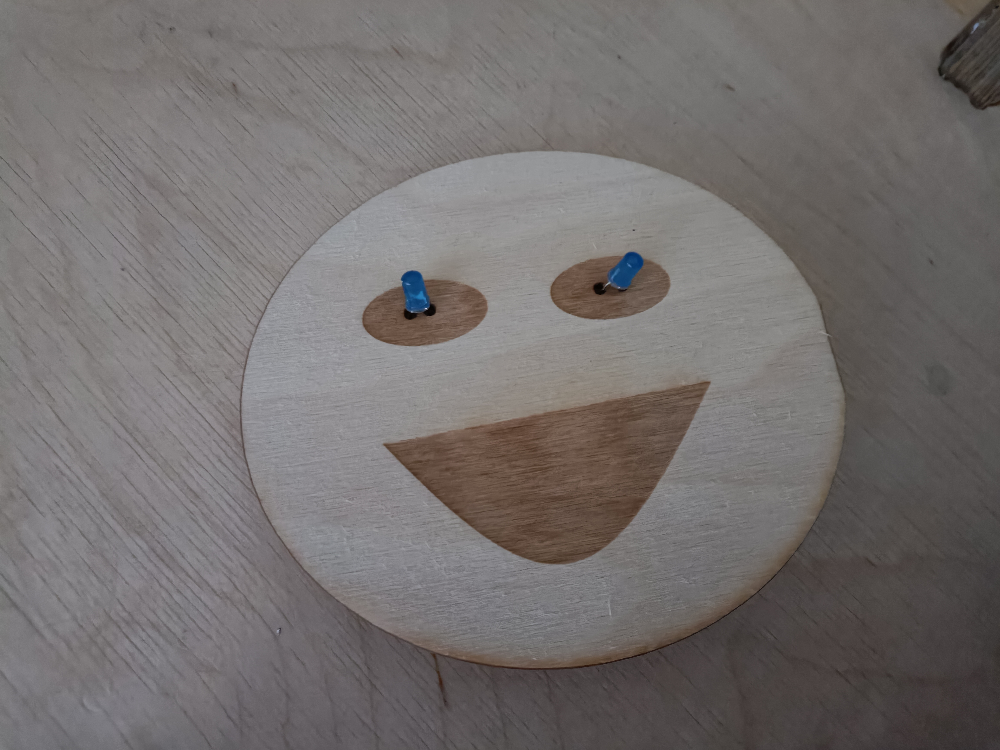
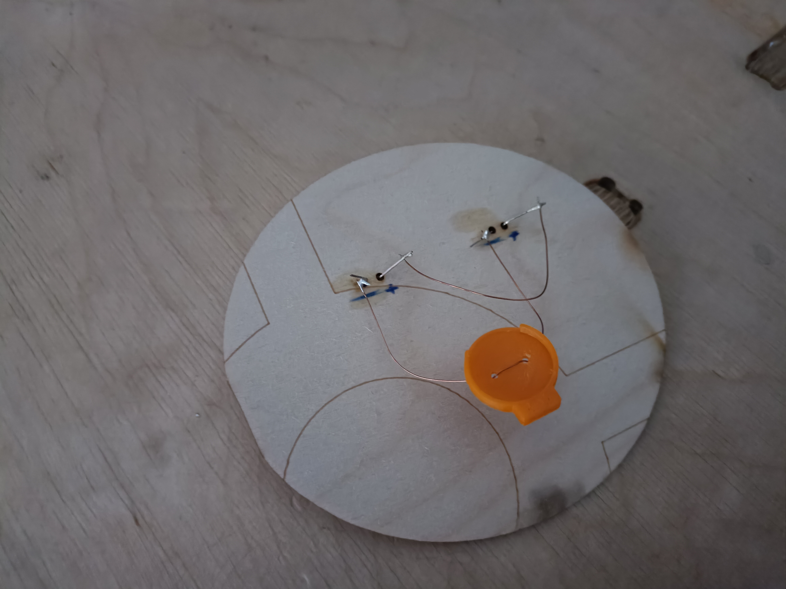

# Buldiga-meme-badge
Для создания было использовано следующее:
1. лист фанеры;
2. 2 светодиода;
3. 2 куска медной проволоки;
4. батарейка cr2032;
5. лазерный гравер;
6. 3D принтер;
7. паяльник;
8. кривые руки.
## Держатель батарейки
3D модель для распечатки была взята [здесь](https://www.thingiverse.com/thing:2808072).
## Сборка
Порядок выполнения следующий:
1. распечатать на 3D принтере держатель батарейки;
2. вырезать на лазерном гравере булдыгу;
3. отрезать 2 куска медной проволоки;
4. соединить куски проволоки с держателем;
5. вставить светодиоды и спаять их + и -;
6. вставить батарейку в держатель и замкнуть цепь.
## Результат
Ниже можно видеть получившееся:

